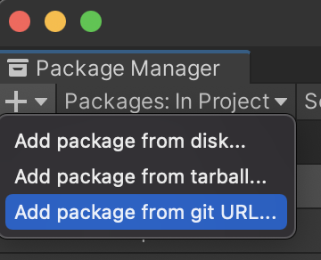
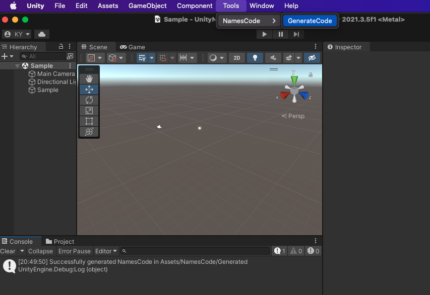
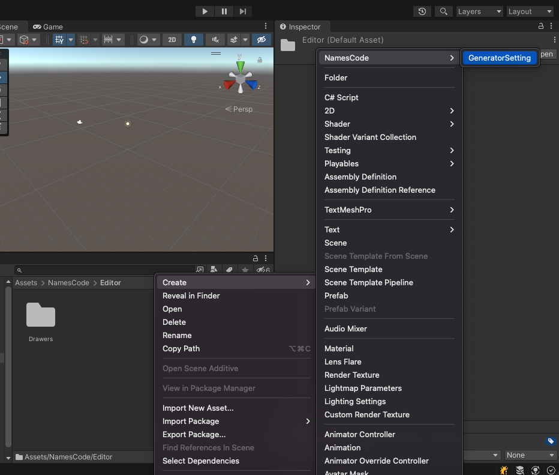
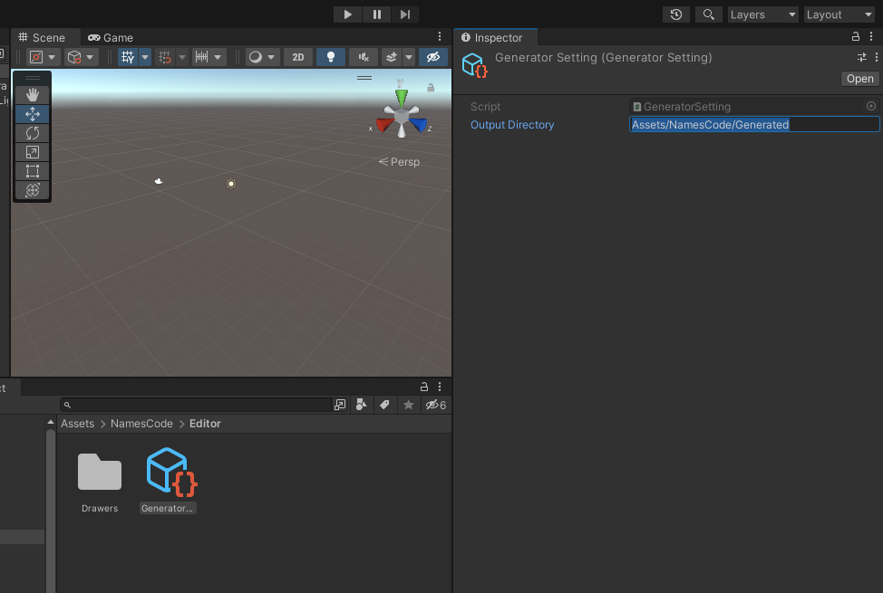

# UnityNamesCodeGenerator
NamesCodeGenerator for Unity generates type safe value objects and static classes from Tag, Layer, SortingLayer, and Scene.

# Install

you can add `https://github.com/doyasu24/UnityNamesCodeGenerator.git?path=Assets/Plugins/NamesCode#3.1.0` to Package Manager



or import unitypackage from [release page](https://github.com/doyasu24/UnityNamesCodeGenerator/releases).

# How to use

Execute `Tools/NamesCode/GenerateCode` from menu to generate the code.



## Output directory

By default, code is generated in `Assets/NamesCode/Generated` directory.

To change the output directory, create a `GeneratorSetting.asset` and place it somewhere in your project.
For example, `Assets/NamesCode/Editor/GeneratorSetting.asset`.



Then, change the value of `OutputDirectory` in GeneratorSetting.



# Code Generation Result

The format policy follows `Microsoft Visual Studio`

```:Layers.cs
// Generated code by NamesCodeGenerator

namespace NamesCode
{
    public static class Layers
    {
        public static readonly LayerName Default = new LayerName("Default", 0);
        public static readonly LayerName TransparentFX = new LayerName("TransparentFX", 1);
        public static readonly LayerName IgnoreRaycast = new LayerName("Ignore Raycast", 2);
        public static readonly LayerName Water = new LayerName("Water", 4);
        public static readonly LayerName UI = new LayerName("UI", 5);

        public static readonly LayerName[] Names =
        {
            Default,
            TransparentFX,
            IgnoreRaycast,
            Water,
            UI,
        };
    }
}
```

# License

MIT